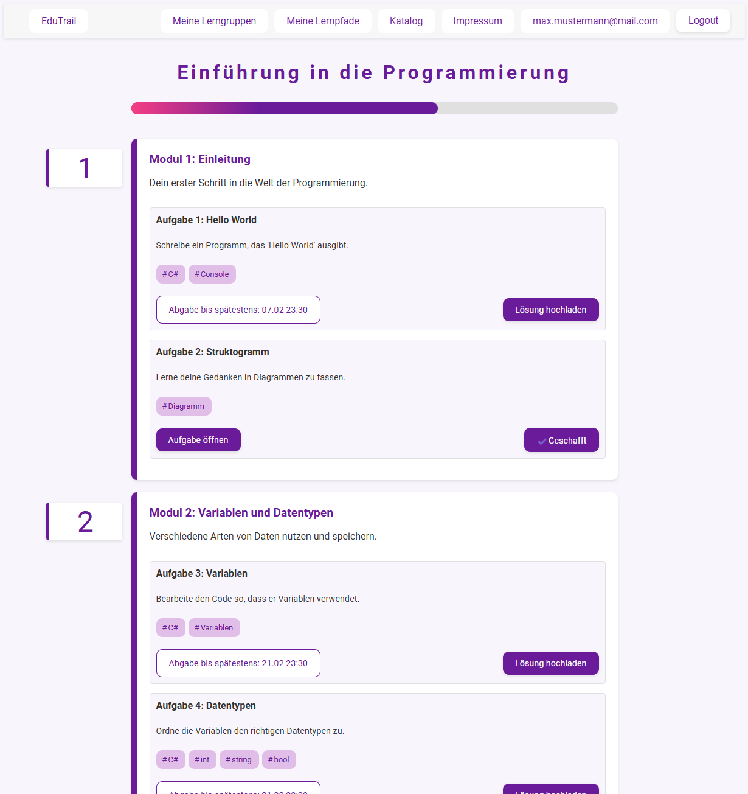
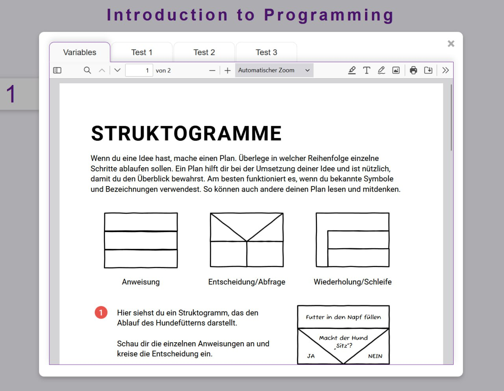

# EduTrail

EduTrail is a Blazor web application designed to create and manage configurable learning trails for students. It provides teachers with tools to monitor progress, manage assignments, and attach materials for enhanced learning experiences.

---

## Overview

## ✅ Features

### For Students

- **Learning Trails:** Structured, easy-to-follow learning paths with rich content, such as documents, videos, and links
- **Progress Tracking:** Monitor individual progress through trail modules and assignments
- **Assignment Submission:** Upload assignments directly for teacher review and feedback

### For Teachers

- **Class Management:** Organize students into classes and assign tailored learning trails
- **Progress Monitoring:** View the progress of individual students and entire classes
- **Assignment Management:** Create, assign, and review student submissions with detailed feedback
- **Content Uploads:** Attach materials like videos, documents, and links to learning modules

---

## 🖼️ Screenshots

### Trail



### Assignment Content



---

## ✒️ Usage

### For Teachers

1. **Create Classes:** Add classes and assign students
2. **Design Learning Trails:** Define learning trails with modules and attach materials
3. **Monitor Progress:** View reports on student performance and completion rates

### For Students

1. **Access Trails:** View assigned learning trails and start tasks
2. **Track Progress:** Use the dashboard to keep track of completed trails and assignments
3. **Submit Assignments:** Upload your work through the portal

## 🚀 Quick Start

1. Clone the repository:

   ```bash
   git clone https://github.com/Alintya/edu-trail.git
   ```

2. Navigate to the project directory:

   ```bash
   cd edu-trail
   ```

3. Set default admin account credentials in `docker-compose.yml`

   ```docker-compose
   environment:
      - EDUTRAIL_DefaultAdminUser__Email=admin@example.com
      - EDUTRAIL_DefaultAdminUser__Password=MyAdminPassword123!
   ```

4. (Recommended) Adjust database user credentials

5. Run

   ```bash
   docker compose up -d
   ```

---

## 👨‍💻 Development and Contributing

### Prerequisites

- .NET 9.0 (for UUIDv7)
- Visual Studio 2022 or any IDE with .NET support
- PostgreSQL Server or Docker (compose)
- Preferably dotnet-ef for migration management (`dotnet tool install --global dotnet-ef`)

### Setup

#### Visual Studio

1. Clone the repository:

   ```bash
   git clone https://github.com/Alintya/edu-trail.git
   ```

2. Open `EduTrail.sln` and run the docker-compose project

#### Other like Visual Studio *Code*

1. Clone the repository:

   ```bash
   git clone https://github.com/Alintya/edu-trail.git
   ```

2. Navigate to the project directory:

   ```bash
   cd edu-trail
   ```

3. Run database

   a. Either standalone or using `docker compose up edutrail.db -d`

   b. (if standalone db) Modify the database connection in `src/EduTrail.WebUI/appsettings.Development.json` where necessary:

      ```json
      "ConnectionStrings": {
         "DefaultConnection": "Server=localhost;Port=5432;Database=edutrail;User Id=myUsername;Password=myPassword;"
      }
      ```

   c. (Optional) Apply migrations manually:

      ```bash
      dotnet ef database update -p src/EduTrail.Infrastructure -s src/EduTrail.WebUI
      ```

4. Run the application (or `dotnet watch` to hot-reload):

   ```bash
   dotnet run --project src/EduTrail.WebUI
   ```

## Built With

- Asp.Net

- EF Core

- Blazor

- Docker

### Architecture

EduTrail tries to follow Clean Architecture principles:

- **Domain Layer:** Core business logic and entities (e.g., `LearningTrail`, `TrailModule`)
- **Application Layer:** Service interfaces, validation, and mapping
- **Infrastructure Layer:** Data access with EF Core, repositories, and external integrations
- **Presentation Layer:** Startup project with Blazor components for the UI

---

## Contributing

Contributions are welcome! To contribute:

1. Fork the repository
2. Create a new branch for your feature/fix
3. Submit a pull request with a clear description of your changes

For additional info, see [Contributing](CONTRIBUTING.md)

---

## 📄 License

TODO
